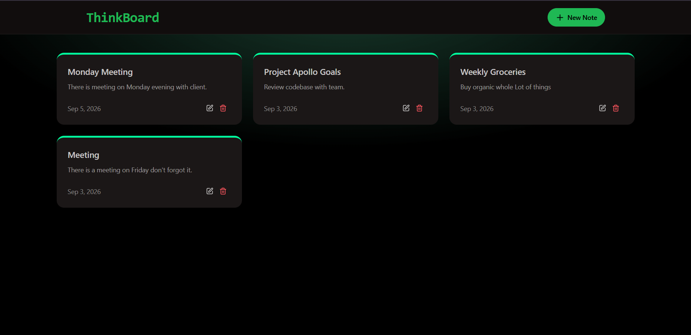

# 📝 ThinkBoard

A simple and modern full-stack note-taking application built with React and Node.js. ThinkBoard allows users to create, view, update, and delete notes through a clean and responsive interface.

## 🚀 Live Demo

**ThinkBoard:** https://thinkboard-asjm.onrender.com/

## 📸 Screenshot




## ✨ Features

* 📝 Create new notes
* 📖 View all notes
* ✏️ Edit existing notes
* 🗑️ Delete notes
* 📱 Responsive user interface
* 🎨 Modern UI with Tailwind CSS and DaisyUI
* ⚡ Fast frontend powered by Vite
* 🔐 API rate limiting
* ☁️ MongoDB database integration
* 🚀 Deployed on Render

## 🛠️ Tech Stack

### Frontend

* React
* Vite
* Tailwind CSS
* DaisyUI
* Axios
* React Router

### Backend

* Node.js
* Express.js
* MongoDB
* Mongoose
* Upstash Redis
* Upstash Rate Limit

### Deployment

* Render

## 📂 Project Structure

```text
ThinkBoard/
├── frontend/
│   ├── public/
│   ├── src/
│   │   ├── assets/
│   │   ├── components/
│   │   ├── lib/
│   │   ├── pages/
│   │   ├── App.jsx
│   │   ├── index.css
│   │   └── main.jsx
│   ├── package.json
│   └── vite.config.js
│
├── backend/
│   ├── src/
│   │   ├── config/
│   │   ├── controllers/
│   │   ├── middleware/
│   │   ├── models/
│   │   ├── routes/
│   │   └── server.js
│   └── package.json
│
└── package.json
```

## ⚙️ Getting Started

### 1. Clone the repository

```bash
git clone https://github.com/md-alihaider/ThinkBoard.git
cd ThinkBoard
```

### 2. Install dependencies

```bash
npm run build
```

### 3. Configure environment variables

Create a `.env` file inside the `backend` folder:

```env
MONGODB_URI=your_mongodb_connection_string
PORT=3000
NODE_ENV=development

UPSTASH_REDIS_REST_URL=your_upstash_redis_url
UPSTASH_REDIS_REST_TOKEN=your_upstash_redis_token
```

### 4. Start the application

```bash
npm start
```

For development:

```bash
npm run dev --prefix backend
```

```bash
npm run dev --prefix frontend
```

## 🔌 API Endpoints

| Method | Endpoint         | Description       |
| ------ | ---------------- | ----------------- |
| GET    | `/api/notes`     | Get all notes     |
| GET    | `/api/notes/:id` | Get a single note |
| POST   | `/api/notes`     | Create a new note |
| PUT    | `/api/notes/:id` | Update a note     |
| DELETE | `/api/notes/:id` | Delete a note     |

## 🌱 What I Learned

While building ThinkBoard, I practiced:

* Building a full-stack application with React and Express
* Connecting a frontend to a backend API
* Working with MongoDB and Mongoose
* Implementing CRUD operations
* Using Axios for API requests
* Adding rate limiting with Upstash
* Managing environment variables
* Deploying a full-stack application on Render
* Serving a React production build through Express

## 🚀 Future Improvements

* User authentication
* Search and filter notes
* Note categories and tags
* Dark mode improvements
* Rich text editing
* Better error handling and loading states

## 👨‍💻 Author

**Ali Haider**

GitHub: [md-alihaider](https://github.com/md-alihaider)

---

⭐ If you like this project, consider giving it a star!
